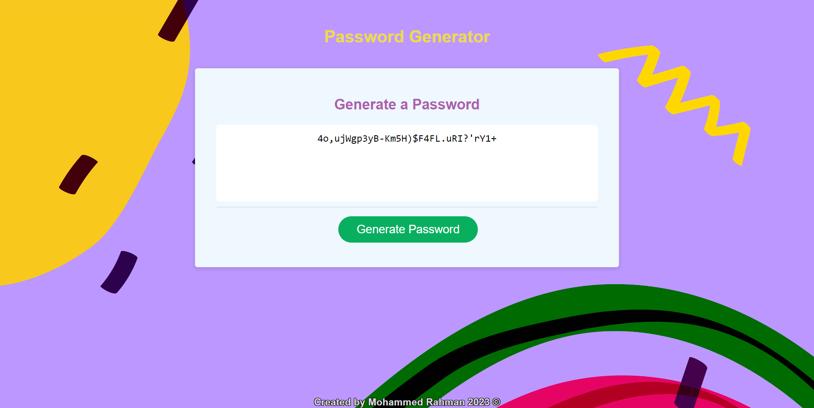

# Using JavaScript to generate a randomised password based off user input

## Created to showcase intermediate JavaScript skills whereby a user answers a list of criteria to generate them a password

The aim of this exercise was to showcase an understanding of JavaScript fundamentals such as the Functions, Parameters, Arrays, Objects, Methods, Logical Operators, For / While Loops & If Statements, Prompts, Confirms & Alerts and Local & Global Scope and etc.

In this project it was required that using these fundamentals to generate a randomised password creating functions that would:

* Gather user input to collect data for password
* An algorithm to generate randomisation from the character types
* Apply data from the user input and randomisation algoritm in an algorithm which would generate the password
* Create a way to use that algorithm to write the password and display it on the webpage.

## Table of Contents

* [Installation](#installation)
* [Usage](#usage)
* [Credits](#credits)
* [License](#license)

## Installation

* Go onto 'https://github.com/mrahman676/password-generator' and clone the repo into your terminal
* Create a folder within your local drive to save the repo in using mkdir 'file-name'
* Use code . to open it in your code editor (mine is VS Code)

## Usage 

* You can find the HTML document (index.html)and the JavaScript file (index.js) within the 'password-generator' document.
* The HTML links to the script.js file for which when you run the index.html file you can see the results of the script.js on the webpage and windows terminal.
* Within the script.js file, each section shows a specific function where globally scoped variables are at the top and locally scoped variables are within each function.

Please check out a preview of the page here:

## Credits

For Pod 4 in Class Session 15/12/2023 by Edx Front End for help in collaborating ideas in completing challenge.

## License

MIT License 2023

For more info please refer to: https://snyk.io/learn/what-is-mit-license/#what-is

## Badges

